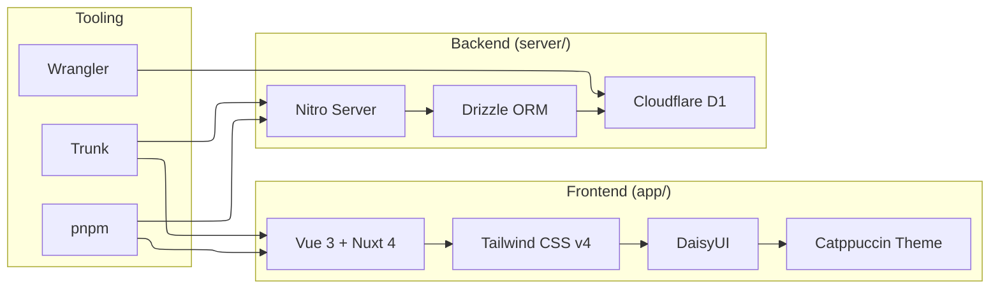
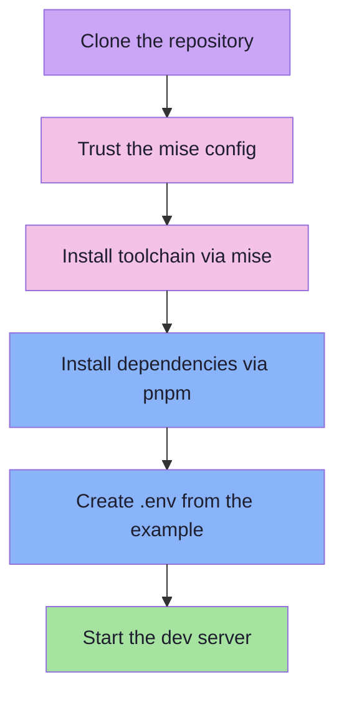
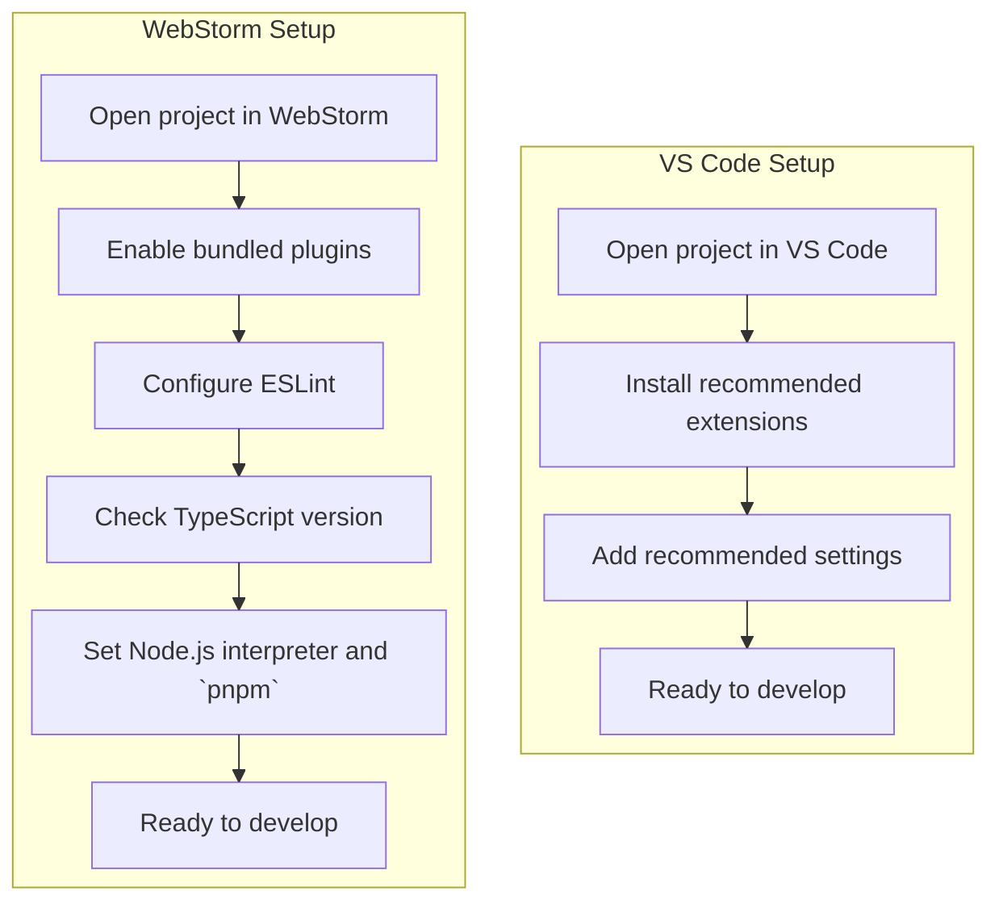
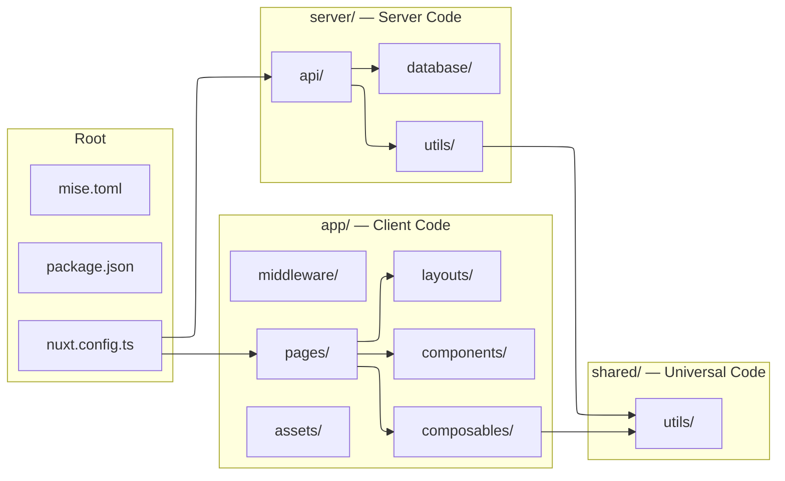
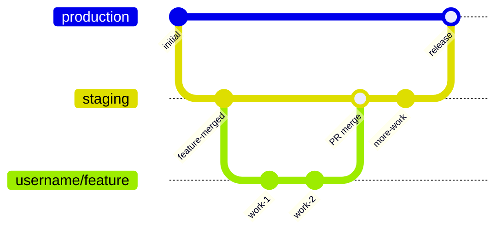
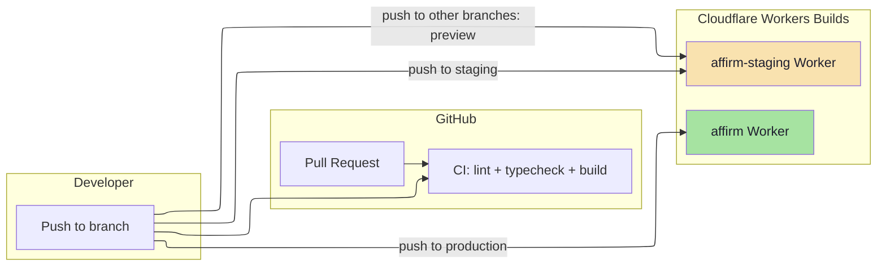
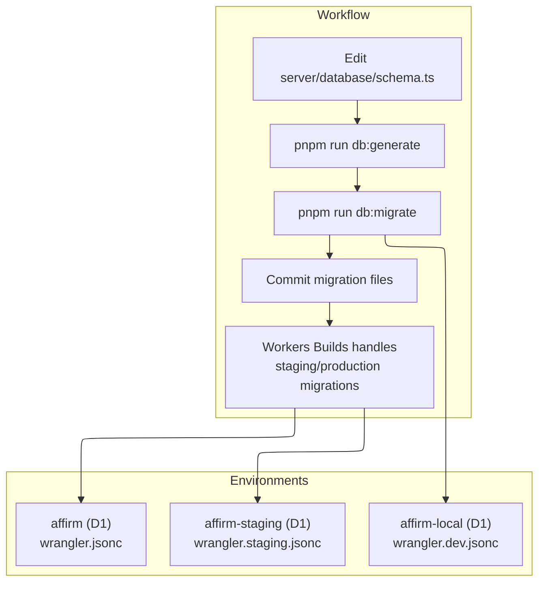

# Get started with Affirm

This guide walks you through setting up the [tecapps/affirm](https://github.com/tecapps/affirm) Nuxt 4 project for frontend development in Visual Studio Code (VS Code) or JetBrains WebStorm.

---

## Overview

Affirm is a Nuxt 4 web application that runs on Cloudflare Workers. It uses `pnpm` to manage packages, Tailwind CSS v4 and DaisyUI for styling, and Drizzle ORM over Cloudflare D1 (SQLite) for data. Trunk runs the linters and formatters.

### Stack at a glance

| Layer           | Technology                        | Notes                                       |
| --------------- | --------------------------------- | ------------------------------------------- |
| Framework       | Nuxt 4                            | Source in the `app/` directory              |
| UI library      | Vue 3 with the Composition API    | `<script setup lang="ts">`                  |
| Styling         | Tailwind CSS v4 and DaisyUI       | Catppuccin Mocha theme                      |
| Content         | Nuxt Content                      | Installed, but not enabled in `modules` yet |
| Package manager | `pnpm`                            | Handles project dependencies and scripts    |
| Database        | Cloudflare D1 and Drizzle ORM     | SQLite on the edge                          |
| Hosting         | Cloudflare Workers                | Separate production and staging Workers     |
| Linting         | Trunk and ESLint                  | Trunk manages most linters and formatters   |
| CI              | GitHub Actions and Workers Builds | Actions runs checks; Workers Builds deploys |


```mermaid
---
config:
  layout: elk
---
graph LR
    subgraph "Frontend (app/)"
        A["Vue 3 + Nuxt 4"]
        B["Tailwind CSS v4"]
        C["DaisyUI"]
        D["Catppuccin Theme"]
    end

    subgraph "Backend (server/)"
        E["Nitro Server"]
        F["Drizzle ORM"]
        G["Cloudflare D1"]
    end

    subgraph "Tooling"
        H["pnpm"]
        I["Trunk"]
        J["Wrangler"]
    end

    A --> B --> C --> D
    E --> F --> G
    H --> A
    H --> E
    I --> A
    I --> E
    J --> G
```

---

## Prerequisites

Sort out the following before you begin.

### Required

- Git, set up to sign your commits. An SSH key works, so you don't need GnuPG (GPG). The GitHub guide to [signing commits](https://docs.github.com/en/authentication/managing-commit-signature-verification/signing-commits) has the details.
- [mise](https://mise.jdx.dev), the version manager this repository uses. It installs `pnpm`, Node.js, and Rust for you.
- Push access to [tecapps/affirm](https://github.com/tecapps/affirm). If you can see the repository but can't push to it, contact syn.

<details>
<summary>Quick setup: SSH commit signing</summary>

```bash
# Tell Git to sign with SSH
git config --global gpg.format ssh

# Point to your SSH key
git config --global user.signingkey ~/.ssh/id_ed25519.pub

# Sign all commits by default
git config --global commit.gpgsign true
```

Then add the same public key to your GitHub account. Go to **Settings** > **SSH and GPG keys** > **New SSH key** and set the key type to **Signing Key**.

</details>

### Optional

- A global install of the Trunk CLI. Trunk ships as a dev dependency that you run with `pnpm exec trunk`, so you only need a global copy if you prefer one. The [Trunk installation docs](https://docs.trunk.io/code-quality/overview/initialize-trunk) cover it.

---

## Installation


```mermaid
---
config:
  layout: elk
---
flowchart TD
    A["Clone the repository"] --> B["Trust the mise config"]
    B --> C["Install toolchain via mise"]
    C --> D["Install dependencies via pnpm"]
    D --> E["Create .env from the example"]
    E --> F["Start the dev server"]

    style A fill:#cba6f7,color:#1e1e2e
    style B fill:#f5c2e7,color:#1e1e2e
    style C fill:#f5c2e7,color:#1e1e2e
    style D fill:#89b4fa,color:#1e1e2e
    style E fill:#89b4fa,color:#1e1e2e
    style F fill:#a6e3a1,color:#1e1e2e
```

### 1. Clone the repository

```bash
git clone git@github.com:tecapps/affirm.git
cd affirm
```

The default branch is `production`, but you don't work on it directly. The [Branching model](#branching-model) section explains how changes reach it.

### 2. Set up tooling with mise

The `mise.toml` file in the repository defines every tool you need and its version. Treat it as the source of truth for tooling. The `.tool-versions` and `.node-version` files exist mainly for Cloudflare Workers Builds, so ignore them.

```bash
# Trust the mise configuration for this repo
mise trust

# Install all tools (pnpm, Node.js, and others)
mise install
```

`mise install` sets up `pnpm`, Node.js, and Rust. Rust is there in case we use WebAssembly later. You can edit `mise.toml` to suit your needs, but your changes affect everyone else too.

### 3. Install dependencies

```bash
pnpm install
```

`pnpm install` also runs the `postinstall` script, which runs `nuxt prepare` and generates the Wrangler types.

### 4. Set up environment variables

```bash
cp .env.example .env
```

Fill in `.env` with the values from [tecapps/secrets](https://github.com/tecapps/secrets). If you're unsure which values you need, ask syn.

> [!WARNING]
> `.dev.vars` is a committed symlink to `.env`, so Wrangler reads the same values. Git ignores `.env` itself, which keeps your secrets out of the repository. Leave the symlink alone: if you replace it with a real file, Git sees a change to a tracked file, and your secrets can end up in a commit.

### 5. Run the dev server

Apply the database migrations to your local D1 database before the first run, and again whenever you pull changes that add migrations:

```bash
pnpm run db:migrate
```

Then start the dev server:

```bash
pnpm run dev
```

The dev server starts at `http://localhost:3000`. It reloads your changes in the browser as you save, and it uses a local D1 database that `wrangler.dev.jsonc` configures.

---

## IDE setup

Choose your fighter. Both editors work well with this stack.

### VS Code

The `.vscode` directory holds the workspace's recommended extensions and a small `settings.json`. When VS Code prompts you to install the recommended extensions on first open, say yes.

To find them later, follow these steps:

1. Open the **Extensions** view with `Ctrl+Shift+X`, or `Cmd+Shift+X` on macOS.
2. In the search box, type `@recommended`.
3. Install every extension in the list.

#### Extensions to install

You need at least the extensions in this table. The workspace recommendations cover Vue - Official, Nuxtr, and Trunk, so add the other four yourself.

| Extension                 | ID                          | Purpose                                                |
| ------------------------- | --------------------------- | ------------------------------------------------------ |
| Vue - Official            | `vue.volar`                 | Vue 3 and Nuxt language support, template type checks  |
| Tailwind CSS IntelliSense | `bradlc.vscode-tailwindcss` | Autocomplete for Tailwind utility classes              |
| ESLint                    | `dbaeumer.vscode-eslint`    | Linting integration                                    |
| Prettier                  | `esbenp.prettier-vscode`    | Code formatting                                        |
| Nuxtr                     | `nuxtr.nuxtr-vscode`        | Nuxt file generators and other Nuxt tooling            |
| EditorConfig              | `editorconfig.editorconfig` | Consistent editor settings from `.editorconfig`        |
| Trunk                     | `trunk.io`                  | Integrates Trunk's multi-linter toolchain into VS Code |

#### Recommended settings

The workspace `.vscode/settings.json` only maps `wrangler.json` to JSON with comments (JSONC). The committed Wrangler configs use the `.jsonc` extension, which VS Code already treats as JSONC. For format-on-save and ESLint fixes, add these to your own VS Code settings:

```json
{
  "editor.formatOnSave": true,
  "editor.defaultFormatter": "dbaeumer.vscode-eslint",
  "eslint.useFlatConfig": true,
  "editor.codeActionsOnSave": {
    "source.fixAll.eslint": "explicit"
  },
  "typescript.tsdk": "node_modules/typescript/lib",
  "files.associations": {
    "*.css": "tailwindcss"
  }
}
```

### JetBrains WebStorm

WebStorm 2025.1 or later supports Nuxt 4, Vue 3, and Tailwind CSS v4 with its bundled plugins, so you don't need extra plugins. Work through the settings below.

#### Initial setup

1. Select **File** > **Open** and choose the `affirm` directory.
2. Go to **Settings** > **Plugins** > **Installed** and make sure you've enabled these bundled plugins:
   - Vue.js
   - JavaScript Debugger
   - Tailwind CSS
   - EditorConfig
3. When WebStorm asks whether to trust the project, click **Trust Project**.

#### Optional plugins

| Plugin              | Purpose                                                    |
| ------------------- | ---------------------------------------------------------- |
| Catppuccin Theme    | Visual consistency with the app's Catppuccin Mocha palette |
| .env files support  | Syntax highlighting for `.env` and `.dev.vars`             |
| Conventional Commit | Helps write conventional commit messages                   |

#### Configure ESLint

1. Go to **Settings** > **Languages & Frameworks** > **JavaScript** > **Code Quality Tools** > **ESLint**.
2. Select **Automatic ESLint configuration**. WebStorm finds the flat config in `eslint.config.mjs` by itself.
3. Turn on **Run eslint --fix on save** so WebStorm lints and fixes each file when you save it.

#### Configure TypeScript

Go to **Settings** > **Languages & Frameworks** > **TypeScript** and check that the TypeScript version points at the project's `node_modules/typescript`. WebStorm usually picks it up automatically.

#### Configure Node.js and `pnpm`

Go to **Settings** > **Languages & Frameworks** > **Node.js**. Set **Node interpreter** to the Node.js 26.10.0 that mise installs, which lives at `~/.local/share/mise/installs/node/26.10.0/bin/node`, and set **Package manager** to `pnpm`.

> [!TIP]
> WebStorm understands Nuxt's auto-imports. If completion for composables such as `useFetch` stops working, select **File** > **Invalidate Caches**, then click **Invalidate and Restart**.


```mermaid
---
config:
  layout: elk
---
flowchart TD
    subgraph "VS Code Setup"
        V1["Open project in VS Code"]
        V2["Install recommended extensions"]
        V3["Add recommended settings"]
        V4["Ready to develop"]

        V1 --> V2 --> V3 --> V4
    end

    subgraph "WebStorm Setup"
        W1["Open project in WebStorm"]
        W2["Enable bundled plugins"]
        W3["Configure ESLint"]
        W4["Check TypeScript version"]
        W5["Set Node.js interpreter and `pnpm`"]
        W6["Ready to develop"]

        W1 --> W2 --> W3 --> W4 --> W5 --> W6
    end
```

---

## Project structure

Affirm uses the Nuxt 4 directory layout. The application source lives in `app/`, apart from the server code in `server/`.

```plaintext
affirm/
├── app/                        # 🖥️ Vue application source
│   ├── assets/                 #    CSS, fonts, images (Tailwind entry point)
│   ├── components/             #    Auto-imported Vue components
│   ├── composables/            #    Auto-imported state/logic (Composition API)
│   ├── layouts/                #    Page layouts
│   ├── middleware/             #    Route middleware
│   ├── pages/                  #    File-based routing
│   └── plugins/                #    Nuxt plugins
│
├── server/                     # ⚙️ Nitro server backend
│   ├── api/                    #    API endpoints (e.g. /api/ping)
│   ├── database/               #    Drizzle schema and migrations
│   └── utils/                  #    Auto-imported server utilities (e.g. useDB)
│
├── shared/                     # 🤝 Code shared between client and server
│   └── utils/
│
├── public/                     # 📁 Static files served at root (favicon, robots.txt)
│
├── .vscode/                    #    VS Code workspace settings & extensions
├── .trunk/                     #    Trunk linting configuration
│
├── nuxt.config.ts              #    Nuxt configuration (incl. D1 env overrides)
├── drizzle.config.ts           #    Drizzle ORM configuration
├── eslint.config.mjs           #    ESLint configuration
├── tsconfig.json               #    TypeScript configuration
├── package.json                #    Dependencies and scripts
├── pnpm-lock.yaml              #    `pnpm` lockfile
├── mise.toml                   #    mise tool version definitions
│
├── wrangler.jsonc              #    Cloudflare Workers config (production)
├── wrangler.staging.jsonc      #    Cloudflare Workers config (staging)
└── wrangler.dev.jsonc          #    Cloudflare Workers config (local dev)
```


```mermaid
---
config:
  layout: elk
---
graph LR
    subgraph "Root"
        NC["nuxt.config.ts"]
        PKG["package.json"]
        MISE["mise.toml"]
    end

    subgraph "app/ — Client Code"
        PAGES["pages/"]
        COMP["components/"]
        COMPOSABLES["composables/"]
        LAYOUTS["layouts/"]
        MW["middleware/"]
        ASSETS["assets/"]
    end

    subgraph "server/ — Server Code"
        API["api/"]
        DB["database/"]
        SUTILS["utils/"]
    end

    subgraph "shared/ — Universal Code"
        SHUTILS["utils/"]
    end

    NC --> PAGES
    NC --> API
    PAGES --> COMP
    PAGES --> COMPOSABLES
    PAGES --> LAYOUTS
    API --> DB
    API --> SUTILS
    COMPOSABLES --> SHUTILS
    SUTILS --> SHUTILS
```

---

## Development patterns

### Vue and TypeScript

Write every Vue component with the Composition API and `<script setup lang="ts">`. The following component shows the pattern:

```vue
<script setup lang="ts">
const { data } = await useFetch("/api/ping");
</script>

<template>
  <div>{{ data?.message }}</div>
</template>
```

Nuxt 4 auto-imports composables such as `useFetch`, `useRouter`, `ref`, and `computed`, along with the components in `app/components/`. Don't import them by hand. If you catch yourself writing `import { ref } from 'vue'` or importing a component from `~/components/`, you're doing it wrong.

### Styling

The project uses Tailwind CSS v4 with DaisyUI component classes and the Catppuccin Mocha theme.

```vue
<template>
  <!-- DaisyUI component classes + Tailwind utilities -->
  <button class="btn btn-primary mt-4">Click me</button>

  <div class="card bg-base-200 shadow-xl p-6">
    <h2 class="card-title">Hello</h2>
    <p>This uses DaisyUI's card component.</p>
  </div>
</template>
```

For the full list of classes, see the [DaisyUI documentation](https://daisyui.com/) for components and the [Tailwind CSS documentation](https://tailwindcss.com/) for utilities.

### Data fetching

Fetch data in pages and components with `useFetch`, which handles server-side rendering (SSR) hydration for you:

```typescript
const { data, pending, error } = await useFetch("/api/ping");
```

### Server API routes

Create API endpoints in `server/api/`. Each file exports a default event handler, and a method suffix such as `.get.ts` limits the route to that HTTP method:

```typescript
// server/api/hello.get.ts
export default defineEventHandler((event) => {
  return { message: "Hello from the server" };
});
```

---

## Essential commands

Here's your cheat sheet. Run every command with `pnpm`.

| Command                   | Purpose                                                             |
| ------------------------- | ------------------------------------------------------------------- |
| `pnpm install`            | Install dependencies                                                |
| `pnpm run dev`            | Start the dev server on `http://localhost:3000`                     |
| `pnpm run build`          | Build for production                                                |
| `pnpm run build:staging`  | Build for staging                                                   |
| `pnpm run lint:fix`       | Run all linters and fix what they can                               |
| `pnpm run format`         | Format code with Prettier and Trunk without staging the changes     |
| `pnpm run test`           | Run tests using the single Vitest configuration                     |
| `pnpm run test:e2e`       | Run end-to-end tests with Playwright                                |
| `pnpm run db:generate`    | Generate database migrations after schema changes                   |
| `pnpm run db:migrate`     | Apply migrations to your local D1 database                          |
| `pnpm run deploy`         | Build and deploy to production by hand, without applying migrations |
| `pnpm run deploy:staging` | Build and deploy to staging by hand, without applying migrations    |

No Vitest test files are checked in. Use `pnpm run test --run --passWithNoTests` to check test discovery without
failing on an empty suite.

The Playwright end-to-end tests live in `tests/e2e/`. `pnpm run test:e2e` applies your local D1 migrations and starts
its own dev server on port 3010, so you don't need `pnpm run dev` running. Before the first run, install the browser
with `pnpm exec playwright install chromium`.

---

## Branching model


```mermaid
---
config:
  gitGraph:
    mainBranchName: production
---
gitGraph
    commit id: "initial"
    branch staging
    checkout staging
    commit id: "feature-merged"

    branch "username/feature"
    checkout "username/feature"
    commit id: "work-1"
    commit id: "work-2"
    checkout staging
    merge "username/feature" id: "PR merge"
    commit id: "more-work"

    checkout production
    merge staging id: "release"
```

The project has two protected branches:

- `staging` is the integration branch. All feature work merges here first.
- `production` is the live deployment branch. It receives merges only from `staging`.

Changes reach either branch only through pull requests.

### Your workflow

1. Create a branch from `staging` named `username/purpose`, for example `synmux/fix-header`.
2. Do your work, and sign every commit.
3. Push your branch. Each push uploads a preview version to the `affirm-staging` Worker, so you can check your changes before they merge.
4. Open a pull request (PR) that targets `staging`. `mise run pr` opens a draft PR for you, and the PR shows each preview build as a check.
5. Get one approval. syn ([@synmux](https://github.com/synmux)) tries to review every PR, but if syn isn't around, any other team member can approve it. A PR from `staging` into `production` needs two approvals.
6. Merge into `staging` once a reviewer approves it. Workers Builds then runs the staging migrations and deploys the new version of `affirm-staging`.

### Commit conventions

Commit messages follow Angular-style Conventional Commits, checked against `.fastconventional.yaml`. Every commit needs a scope, as in `feat(frontend): add login form`. The allowed scopes are `backend`, `bothends`, `ci`, `docs`, `frontend`, `ops`, and `tests`. Use the standard types such as `feat`, `fix`, `docs`, `refactor`, and `test`, plus the custom `experiment` type.

### Commit signing

Git can sign commits with an SSH key, so if you already push over SSH you probably have a key that works. The [Prerequisites](#prerequisites) section has the setup commands.

---

## Deployment

Cloudflare Workers Builds handles deployment, and no GitHub Actions workflow deploys anything. The `ci.yaml` workflow only runs lint, typecheck, and build checks.


```mermaid
---
config:
  layout: elk
---
flowchart LR
    subgraph "Developer"
        DEV["Push to branch"]
    end

    subgraph "GitHub"
        CI["CI: lint + typecheck + build"]
        PR["Pull Request"]
    end

    subgraph "Cloudflare Workers Builds"
        STG["affirm-staging Worker"]
        PROD["affirm Worker"]
    end

    DEV --> CI
    DEV -->|"push to staging"| STG
    DEV -->|"push to production"| PROD
    DEV -->|"push to other branches: preview"| STG
    PR --> CI

    style STG fill:#f9e2af,color:#1e1e2e
    style PROD fill:#a6e3a1,color:#1e1e2e
```

| Trigger                  | Worker           | Effect                                                               |
| ------------------------ | ---------------- | -------------------------------------------------------------------- |
| Push to `staging`        | `affirm-staging` | Runs migrations on the staging D1 database, deploys to live staging  |
| Push to `production`     | `affirm`         | Runs migrations on the production D1 database, deploys to live       |
| Push to any other branch | `affirm-staging` | Uploads a preview version without deploying it or running migrations |

### Manual deployment (escape hatch)

If you need to deploy outside of Workers Builds, apply the migrations yourself first.

> [!WARNING]
> The `deploy` and `deploy:staging` scripts only build and run `wrangler deploy`. They don't apply D1 migrations, so run the matching `db:migrate:*` script first, or the new code goes live against the old schema.

```bash
# Production
pnpm run db:migrate:prod
pnpm run deploy

# Staging
pnpm run db:migrate:staging
pnpm run deploy:staging
```

`deploy:staging` sends the new version straight to live staging traffic, as a push to `staging` does. To upload a version without deploying it, as Workers Builds does for other branches, use `pnpm run deploy:snapshot`. It skips migrations too.

---

## Database

The app uses Cloudflare D1 (SQLite) with Drizzle ORM across three environments:

| Environment | Wrangler config          | D1 database    | Worker         |
| ----------- | ------------------------ | -------------- | -------------- |
| Local dev   | `wrangler.dev.jsonc`     | affirm-local   | (local)        |
| Staging     | `wrangler.staging.jsonc` | affirm-staging | affirm-staging |
| Production  | `wrangler.jsonc`         | affirm         | affirm         |


```mermaid
---
config:
  layout: elk
---
flowchart TD
    subgraph "Environments"
        DEV_DB["affirm-local (D1)\nwrangler.dev.jsonc"]
        STG_DB["affirm-staging (D1)\nwrangler.staging.jsonc"]
        PROD_DB["affirm (D1)\nwrangler.jsonc"]
    end

    subgraph "Workflow"
        S1["Edit server/database/schema.ts"]
        S2["pnpm run db:generate"]
        S3["pnpm run db:migrate"]
        S4["Commit migration files"]
        S5["Workers Builds handles\nstaging/production migrations"]
    end

    S1 --> S2 --> S3 --> DEV_DB
    S3 --> S4 --> S5
    S5 --> STG_DB
    S5 --> PROD_DB
```

### Schema changes

1. Edit `server/database/schema.ts`.
2. To create a migration, run `pnpm run db:generate`.
3. To apply it locally, run `pnpm run db:migrate`.
4. Commit the migration files. When you push to `staging` or `production`, Workers Builds applies them to that environment's D1 database before deploying. The manual deploy scripts don't, so read [Manual deployment](#manual-deployment-escape-hatch) before you deploy by hand.

---

## Gotchas

A few things in this project catch people out.

- This project uses Nuxt 4. The Nuxt 3 docs differ in places, especially around the `app/` directory, so use the [Nuxt 4 documentation](https://nuxt.com/docs/4.x).
- The Wrangler config files and `nuxt.config.ts` both define the D1 bindings. Nitro, the server engine under Nuxt, generates its own Wrangler config at build time from `nuxt.config.ts`. Keep the two in sync.
- Every build needs an `--envName` because a bare `nuxt build` produces no D1 binding. Use the `build` and `build:staging` scripts, which pass it for you.

---

## Setup checklist

Tick off each item as you complete it:

- [ ] Set up SSH commit signing
- [ ] Install mise
- [ ] Clone the repository and `cd affirm`
- [ ] Run `mise trust && mise install`
- [ ] Run `pnpm install`, then check `git status`
- [ ] Copy `.env.example` to `.env` and fill in the values from `tecapps/secrets`
- [ ] Run `pnpm run db:migrate` to set up your local D1 database
- [ ] Run `pnpm run dev` and open `http://localhost:3000`
- [ ] Set up your IDE extensions or plugins
- [ ] Create a test branch called `yourname/test-setup`
- [ ] Run `pnpm run lint:fix` to check that linting works

---

## Get help

If you're stuck or something isn't working, ask syn ([@synmux](https://github.com/synmux)), who's more than happy to help.
