```mermaid
---
config:
  layout: elk
---
graph LR
    subgraph "Root"
        NC["nuxt.config.ts"]
        PKG["package.json"]
        MISE["mise.toml"]
    end

    subgraph "app/ — Client Code"
        PAGES["pages/"]
        COMP["components/"]
        COMPOSABLES["composables/"]
        LAYOUTS["layouts/"]
        MW["middleware/"]
        ASSETS["assets/"]
    end

    subgraph "server/ — Server Code"
        API["api/"]
        DB["database/"]
        SUTILS["utils/"]
    end

    subgraph "shared/ — Universal Code"
        SHUTILS["utils/"]
    end

    NC --> PAGES
    NC --> API
    PAGES --> COMP
    PAGES --> COMPOSABLES
    PAGES --> LAYOUTS
    API --> DB
    API --> SUTILS
    COMPOSABLES --> SHUTILS
    SUTILS --> SHUTILS
```

# Getting Started with Affirm

A developer's guide to setting up the [tecapps/affirm](https://github.com/tecapps/affirm) Nuxt 4 project for frontend development, covering both **VS Code** and **JetBrains WebStorm**.

---

## Overview

Affirm is a **Nuxt 4** web application deployed to **Cloudflare Workers**. It uses **Bun** as its package manager, **Tailwind CSS v4** with **DaisyUI** for styling, **Drizzle ORM** with **Cloudflare D1** (SQLite) for the database, and **Trunk** for linting/formatting.

### Stack at a Glance

| Layer      | Technology                      | Notes                                     |
| ---------- | ------------------------------- | ----------------------------------------- |
| Framework  | Nuxt 4                          | Source in `app/` directory                |
| UI Library | Vue 3 (Composition API)         | `<script setup lang="ts">`                |
| Styling    | Tailwind CSS v4 + DaisyUI       | Catppuccin Mocha theme                    |
| Content    | Nuxt Content                    | Markdown-based copywriting                |
| Runtime    | Bun                             | Package manager and dev scripts           |
| Database   | Cloudflare D1 + Drizzle ORM     | SQLite on the edge                        |
| Hosting    | Cloudflare Workers              | Separate prod & staging workers           |
| Linting    | Trunk + ESLint                  | Multi-tool orchestration                  |
| CI         | GitHub Actions + Workers Builds | CI checks only; deployment via Cloudflare |


---

## Prerequisites

Before you begin, you'll need the following installed on your machine.

### Required

- **Git** — with commit signing configured (SSH key signing is fine; GPG is not required). See the [GitHub docs on signing commits](https://docs.github.com/en/authentication/managing-commit-signature-verification/signing-commits).

<details>
<summary>Quick setup: SSH commit signing</summary>

```bash
# Tell Git to sign with SSH
git config --global gpg.format ssh

# Point to your SSH key
git config --global user.signingkey ~/.ssh/id_ed25519.pub

# Sign all commits by default
git config --global commit.gpgsign true
```

Then add the same public key to your GitHub account under **Settings → SSH and GPG keys → New SSH key** (select _Signing Key_ as the type).

</details>
- **mise** — the recommended version manager. Install it from [mise.jdx.dev](https://mise.jdx.dev). mise will handle installing Bun, Node.js, and other tools for you.

- **GitHub Access** — ensure you have push access to [tecapps/affirm](https://github.com/tecapps/affirm). If you can see the repo but can't push, contact Dave.

### Optional but Recommended

- **Trunk CLI** — installed globally if you prefer, otherwise it's available as a dev dependency via `bun run trunk`. See the [Trunk docs](https://docs.trunk.io/code-quality/overview/initialize-trunk).

---

## Installation


### 1. Clone the Repository

```bash
git clone git@github.com:tecapps/affirm.git
cd affirm
```

The default branch is `production`. You won't work on this branch directly — more on that in the [Branching Model](#branching-model) section.

### 2. Set Up Tooling with mise

The repository includes a `mise.toml` that defines all required tools and their versions. This is the **source of truth** for tooling — ignore `.tool-versions` and `.node-version`, which exist primarily for Cloudflare Workers Builds.

```bash
# Trust the mise configuration for this repo
mise trust

# Install all tools (Bun, Node.js, and others)
mise install
```

This will install Bun, Node.js, and a few extras (coding agent CLIs, Rust for potential future WASM use). Feel free to customise `mise.toml` for your own needs, but be aware changes affect everyone.

### 3. Install Dependencies

```bash
bun install
```

This also runs the `postinstall` hook, which sets up Trunk (the linter/formatter orchestrator).

### 4. Set Up Environment Variables

```bash
cp .env.example .env
cp .dev.vars.example .dev.vars
```

Edit these files with any required local values. Ask Dave if you're unsure what values to use.

> ⚠️ **Warning:** The `.dev.vars` file contains Cloudflare-specific secrets for local development. Never commit it — it's already in `.gitignore`.

### 5. Run the Dev Server

```bash
bun dev
```

The development server will start at [http://localhost:3000](http://localhost:3000). It runs with hot-module replacement and a local D1 database via `wrangler.dev.jsonc`.

If you've pulled changes that include new database migrations, apply them to your local D1 before starting work:

```bash
bun run db:migrate
```

---

## IDE Setup

Choose your fighter. Both editors work well with this stack; the choice is yours.

### VS Code

The repository includes a `.vscode` directory with recommended extensions and workspace settings. When you first open the project, VS Code will prompt you to install the recommended extensions — **do it**.

You can also view them manually:

1. Open the **Extensions** panel (`Ctrl+Shift+X` / `Cmd+Shift+X`).
2. Type `@recommended` in the search bar.
3. Install everything listed there.

#### Key Extensions You'll Want

At a minimum, ensure you have:

| Extension                                                   | Purpose                                                |
| ----------------------------------------------------------- | ------------------------------------------------------ |
| **Vue - Official** (`Vue.volar`)                            | Vue 3 / Nuxt language support, template type-checking  |
| **Tailwind CSS IntelliSense** (`bradlc.vscode-tailwindcss`) | Autocomplete for Tailwind utility classes              |
| **ESLint** (`dbaeumer.vscode-eslint`)                       | Linting integration                                    |
| **Prettier** (`esbenp.prettier-vscode`)                     | Code formatting                                        |
| **Nuxtr** (`nuxtr.nuxtr-vscode`)                            | Nuxt-specific tooling (file generators, etc.)          |
| **EditorConfig** (`editorconfig.editorconfig`)              | Consistent editor settings from `.editorconfig`        |
| **Trunk** (`trunk.io`)                                      | Integrates Trunk's multi-linter toolchain into VS Code |

#### Recommended Settings

The workspace `.vscode/settings.json` should handle most of this, but verify these are present:

```json
{
  "editor.formatOnSave": true,
  "editor.defaultFormatter": "dbaeumer.vscode-eslint",
  "eslint.useFlatConfig": true,
  "editor.codeActionsOnSave": {
    "source.fixAll.eslint": "explicit"
  },
  "typescript.tsdk": "node_modules/typescript/lib",
  "files.associations": {
    "*.css": "tailwindcss"
  }
}
```

### JetBrains WebStorm

WebStorm 2025.1+ has excellent built-in support for Nuxt 4, Vue 3, and Tailwind CSS v4. No additional plugins are strictly required beyond the defaults, but check the following.

#### Initial Setup

1. **Open the project** — use `File → Open` and select the `affirm` directory.
2. **Verify built-in plugins are enabled** — go to `Settings → Plugins → Installed` and ensure these are active:
   - Vue.js
   - JavaScript Debugger
   - Tailwind CSS
   - EditorConfig
3. **Trust the project** — when prompted about running project scripts, trust the project.

#### Optional Plugins

| Plugin                  | Purpose                                                    |
| ----------------------- | ---------------------------------------------------------- |
| **Catppuccin Theme**    | Visual consistency with the app's Catppuccin Mocha palette |
| **.env files support**  | Syntax highlighting for `.env` and `.dev.vars`             |
| **Conventional Commit** | Helps write conventional commit messages                   |

#### Configure ESLint

1. Go to **Preferences → Languages & Frameworks → JavaScript → Code Quality Tools → ESLint**.
2. Select **"Automatic ESLint configuration"** — WebStorm will detect the flat config in `eslint.config.mjs` automatically.
3. Enable **"Run eslint --fix on save"** — this ensures code is automatically formatted and linted when you save.

#### Configure TypeScript

Go to **Preferences → Languages & Frameworks → TypeScript** and ensure the TypeScript version is set to the project's `node_modules/typescript`. WebStorm usually detects this automatically.

#### Configure Bun

Go to **Preferences → Languages & Frameworks → Node.js** and set the package manager to **bun**. Point the interpreter to the mise shim for Bun (typically `~/.local/share/mise/shims/bun`).

> 💡 **Tip:** WebStorm natively supports Nuxt's auto-imports. If auto-completion for composables like `useFetch` isn't working, try **File → Invalidate Caches → Restart**.


---

## Project Structure

Affirm follows the **Nuxt 4** directory convention. The key difference from Nuxt 3 is that application source code lives under the `app/` directory, providing a clear separation between client-side and server-side code.

```plaintext
affirm/
├── app/                        # 🖥️ Vue application source
│   ├── assets/                 #    CSS, fonts, images (Tailwind entry point)
│   ├── components/             #    Auto-imported Vue components
│   ├── composables/            #    Auto-imported state/logic (Composition API)
│   ├── layouts/                #    Page layouts
│   ├── middleware/              #    Route middleware
│   └── pages/                  #    File-based routing
│
├── server/                     # ⚙️ Nitro server backend
│   ├── api/                    #    API endpoints (e.g. /api/hello)
│   ├── database/               #    Drizzle schema and migrations
│   └── utils/                  #    Auto-imported server utilities (e.g. useDB)
│
├── shared/                     # 🤝 Code shared between client and server
│   └── utils/
│
├── public/                     # 📁 Static files served at root (favicon, robots.txt)
│
├── .vscode/                    #    VS Code workspace settings & extensions
├── .trunk/                     #    Trunk linting configuration
│
├── nuxt.config.ts              #    Nuxt configuration (incl. D1 env overrides)
├── drizzle.config.ts           #    Drizzle ORM configuration
├── eslint.config.mjs           #    ESLint configuration
├── tsconfig.json               #    TypeScript configuration
├── package.json                #    Dependencies and scripts
├── bun.lock                    #    Bun lockfile
├── mise.toml                   #    mise tool version definitions
│
├── wrangler.jsonc              #    Cloudflare Workers config (production)
├── wrangler.staging.jsonc      #    Cloudflare Workers config (staging)
└── wrangler.dev.jsonc          #    Cloudflare Workers config (local dev)
```



---

## Development Patterns

### Vue & TypeScript

All Vue components should use the **Composition API** with `<script setup lang="ts">`:

```vue
<script setup lang="ts">
const { data } = await useFetch("/api/hello");
</script>

<template>
  <div>{{ data?.message }}</div>
</template>
```

Nuxt 4 **auto-imports** composables (`useFetch`, `useRouter`, `ref`, `computed`, etc.) and components from `app/components/`. Do not manually import these — if you find yourself writing `import { ref } from 'vue'` or importing a component from `~/components/`, you're doing it wrong.

### Styling

The project uses **Tailwind CSS v4** with **DaisyUI** component classes and the **Catppuccin Mocha** theme.

```vue
<template>
  <!-- DaisyUI component classes + Tailwind utilities -->
  <button class="btn btn-primary mt-4">Click me</button>

  <div class="card bg-base-200 shadow-xl p-6">
    <h2 class="card-title">Hello</h2>
    <p>This uses DaisyUI's card component.</p>
  </div>
</template>
```

Refer to the [DaisyUI documentation](https://daisyui.com/) for available component classes and the [Tailwind CSS documentation](https://tailwindcss.com/) for utility classes.

### Data Fetching

Use `useFetch` for all data fetching in pages and components. It handles SSR hydration automatically:

```typescript
const { data, pending, error } = await useFetch("/api/hello");
```

### Server API Routes

Create API endpoints in `server/api/`. Export a default event handler:

```typescript
// server/api/hello.ts
export default defineEventHandler((event) => {
  return { message: "Hello from the server" };
});
```

---

## Essential Commands

All commands are run with `bun`. Here's your cheat sheet:

| Command                  | Purpose                                     |
| ------------------------ | ------------------------------------------- |
| `bun install`            | Install dependencies                        |
| `bun dev`                | Start development server (localhost:3000)   |
| `bun run build`          | Build for production                        |
| `bun run build:staging`  | Build for staging                           |
| `bun run lint:fix`       | Run all linters and auto-fix                |
| `bun run format`         | Format code (Prettier + Trunk)              |
| `bun run test`           | Run unit tests (Vitest)                     |
| `bun run test:e2e`       | Run end-to-end tests (Playwright)           |
| `bun run db:generate`    | Generate DB migrations after schema changes |
| `bun run db:migrate`     | Apply migrations to local D1                |
| `bun run deploy`         | Manual deploy to production                 |
| `bun run deploy:staging` | Manual deploy to staging                    |

---

## Branching Model


The project uses two protected branches:

- **`staging`** — the integration branch. All feature work merges here first.
- **`production`** — the live deployment branch. Only receives merges from `staging`.

Both branches are protected; changes can only arrive via pull requests.

### Your Workflow

1. **Create a branch** from `staging` named `username/purpose`, e.g. `daveio/fix-header`.
2. **Do your work**, committing with signed commits.
3. **Push your branch** — this triggers a preview deployment on the `affirm-staging` Worker automatically, so you can validate before raising a PR.
4. **Open a pull request** targeting `staging`.
5. **Get two approvals** — Dave ([@daveio](https://github.com/daveio)) will try to review all PRs; you'll need one other reviewer as well.
6. **Merge** — once approved, merge to `staging`. Cloudflare Workers Builds handles the deployment.

### Commit Conventions

The project uses a `.fastconventional.yaml` config for commit message conventions. Use prefixes like `feat:`, `fix:`, `chore:`, `docs:`, `refactor:`, `test:`, `style:`, etc.

### Commit Signing

Please **sign your commits**. Git supports SSH key signing now, so you don't need GPG. If you already push via SSH, you likely have a suitable key. See the [GitHub documentation](https://docs.github.com/en/authentication/managing-commit-signature-verification/signing-commits) for setup instructions.

---

## Deployment

Deployment is handled entirely by **Cloudflare Workers Builds** — there is no GitHub Actions deployment workflow. CI (`ci.yaml`) runs lint, typecheck, and build checks only.


| Trigger                | Worker           | Effect                                                    |
| ---------------------- | ---------------- | --------------------------------------------------------- |
| Push to `staging`      | `affirm-staging` | Runs migrations on staging D1, uploads new version        |
| Push to `production`   | `affirm`         | Runs migrations on production D1, deploys to live traffic |
| PR targeting `staging` | `affirm-staging` | Uploads a preview version (no migrations)                 |

### Manual Deployment (Escape Hatch)

If you ever need to deploy outside of Workers Builds:

```bash
# Production
bun run deploy

# Staging
bun run deploy:staging
```

---

## Database

The app uses **Cloudflare D1** (SQLite) with **Drizzle ORM**. There are three environments:

| Environment | Wrangler Config          | D1 Database    | Worker         |
| ----------- | ------------------------ | -------------- | -------------- |
| Local dev   | `wrangler.dev.jsonc`     | affirm-local   | —              |
| Staging     | `wrangler.staging.jsonc` | affirm-staging | affirm-staging |
| Production  | `wrangler.jsonc`         | affirm         | affirm         |


### Schema Changes

1. Edit `server/database/schema.ts`.
2. Run `bun run db:generate` to create a migration.
3. Run `bun run db:migrate` to apply it locally.
4. Commit the migration files — Workers Builds handles staging and production migrations on deploy.

---

## Gotchas

There are a few things that can catch you out. Keep these in mind:

- **This is Nuxt 4, not Nuxt 3.** The Nuxt 3 docs may differ significantly, especially regarding the `app/` directory structure. Always refer to the [Nuxt 4 documentation](https://nuxt.com/docs/4.x).
- **D1 bindings exist in two places.** Both the Wrangler config files and `nuxt.config.ts` define D1 bindings (because Nitro generates a separate Wrangler config at build time). Keep them in sync.
- **Always use `--envName` for builds.** A bare `nuxt build` produces no D1 binding. The `build` and `build:staging` scripts handle this for you — use them.
- **`bun run build`, not `bun build`.** The latter clashes with Bun's internal build command. Always use `bun run build`.
- **Auto-imports are your friend.** Don't manually import Vue composables or components from `app/components/`. Nuxt handles this.
- **Trunk is a dev dependency, not global.** Invoke it via `bun run trunk`, or install it globally by following [the Trunk docs](https://docs.trunk.io/code-quality/overview/initialize-trunk).

---

## Setup Checklist

Tick off each item as you complete it:

- [ ] Install mise and run `mise trust && mise install`
- [ ] Clone the repo and `cd affirm`
- [ ] Run `bun install`
- [ ] Copy `.env.example → .env` and `.dev.vars.example → .dev.vars`
- [ ] Set up your IDE (extensions/plugins configured)
- [ ] Run `bun dev` and open localhost:3000
- [ ] Run `bun run db:migrate` to set up local D1
- [ ] Set up SSH commit signing
- [ ] Create a test branch `yourname/test-setup`
- [ ] Run `bun run lint:fix` to verify linting works

---

## Getting Help

If you're stuck, have questions, or something isn't working as expected — just ask Dave. He's more than happy to help.

Happy coding! 🎉
